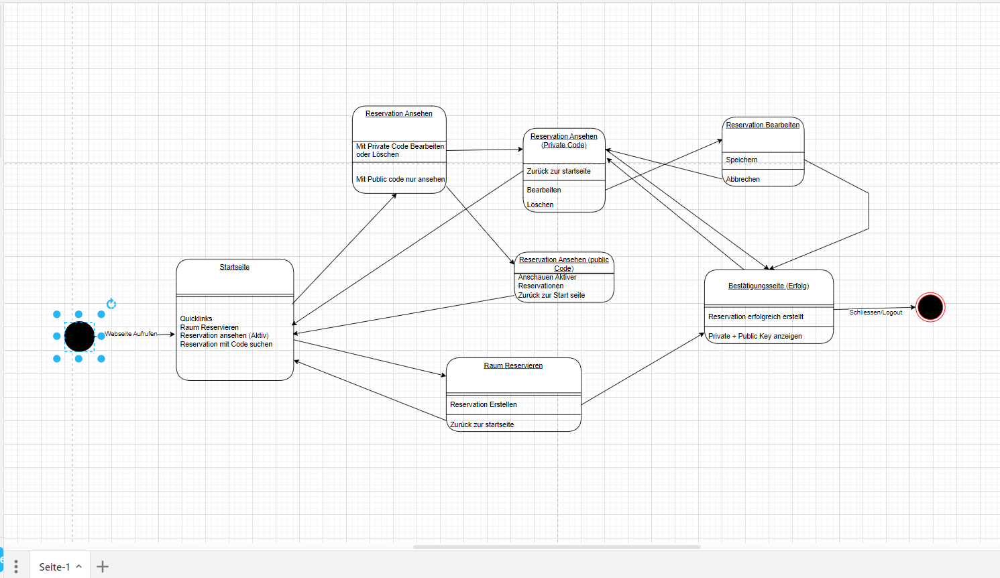
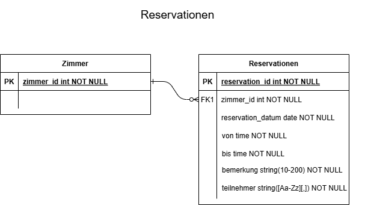
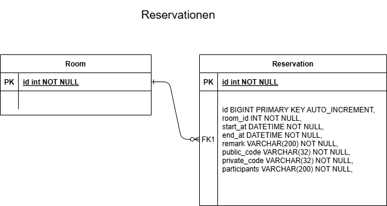
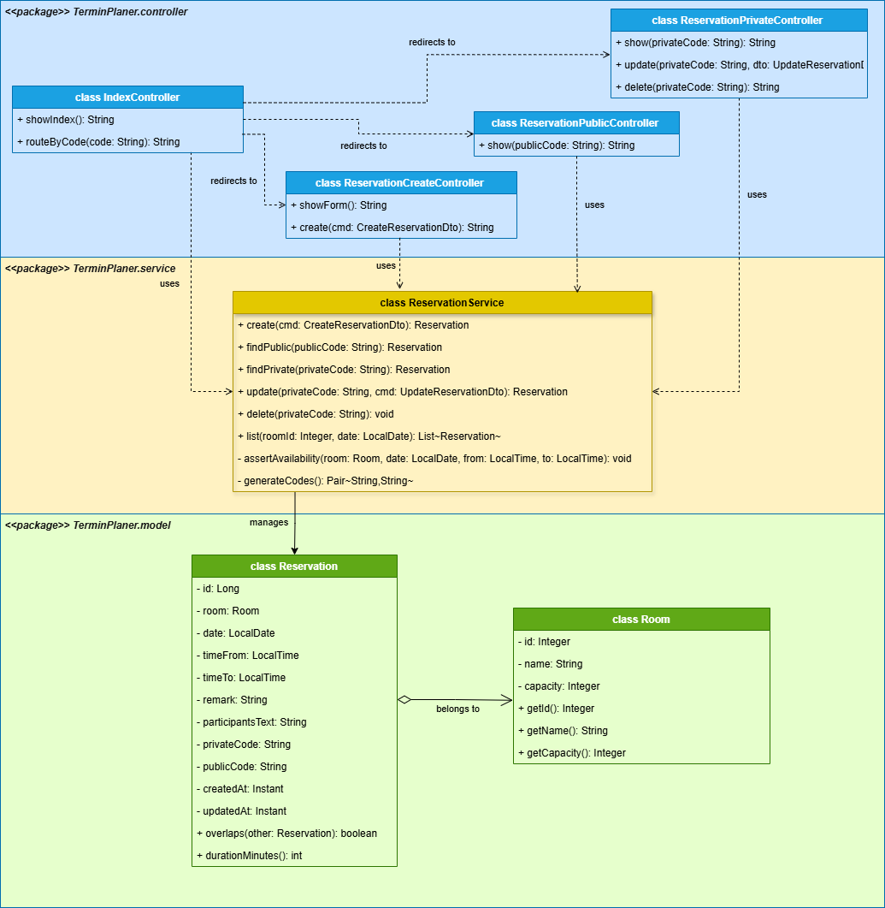
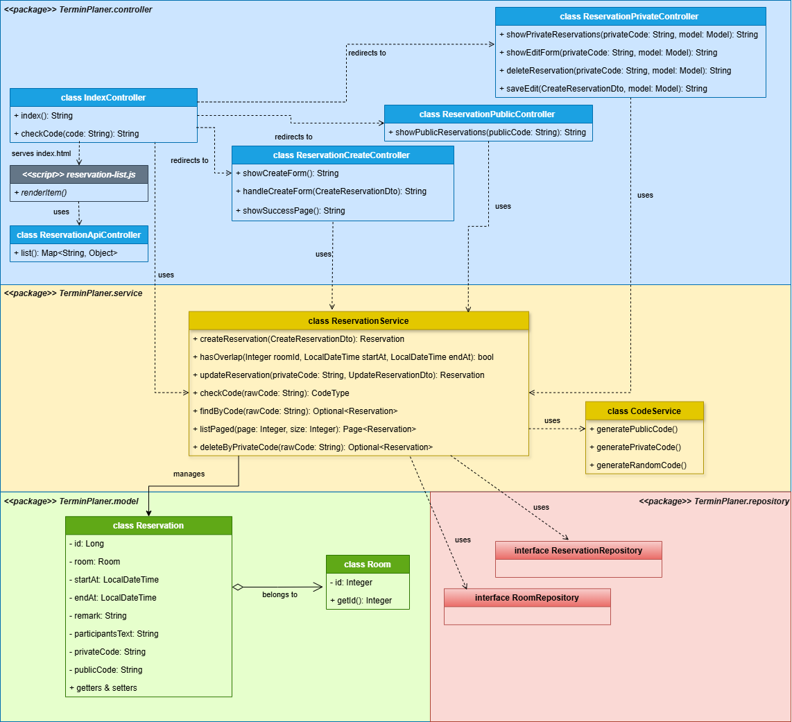
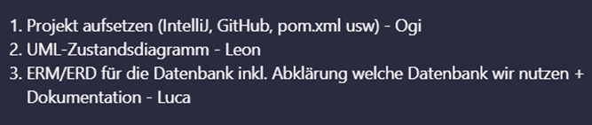
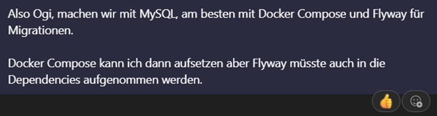
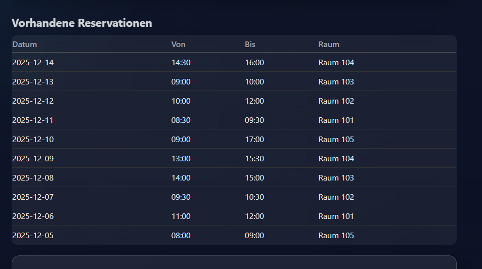

# Projektarbeit M223
## Abschlussprojekt – Termin Planer
**Oguzhan Cetinkaya, Leon Reiter, Luca Waldvogel**

## Initialisierung

Bei der ersten Initialisierung muss init mode in den application.properties von "never" auf "always" angepasst werden
> spring.sql.init.mode=always

---

## Inhaltsverzeichnis
1. [Vorwort](#1-vorwort)
2. [Diagramme](#2-diagramme)  
   2.1 [UML-Zustandsdiagramm](#21-uml-zustandsdiagramm)  
   2.2 [ERM/ERD](#22-ermerd)  
   2.3 [UML-Klassendiagramm](#23-uml-klassendiagramm)
3. [Journal](#3-journal)

---

## 1. Vorwort

Im Modul M223 „Multiuser-Applikationen objektorientiert realisieren“ bestand die Aufgabe darin, eine vollständige Webanwendung im Team zu entwickeln.  
Unsere Anwendung – **Termin Planer** – ermöglicht die Verwaltung von Räumen und Terminen in einem Unternehmensgebäude.  
Benutzer können Räume für Sitzungen oder Veranstaltungen reservieren, die Reservationen verwalten und mit privaten oder öffentlichen Schlüsseln teilen.  
Das Projekt umfasst die Modellierung (UML- und ER-Diagramme), die Implementierung der Model- und Controller-Klassen sowie eine funktionierende Datenbankanbindung mit MySQL und Docker.

---

## 2. Diagramme

### 2.1 UML-Zustandsdiagramm
Version 1

### 2.2 ERM/ERD
Version 1

Version 2

### 2.3 UML-Klassendiagramm
Version 1

Version 2

---

## 3. Journal

| Datum      | Aufwand    | Wer     | Was                                                                                                                                                                                                                                                                                                                     |
|:-----------|:-----------|:--------|:------------------------------------------------------------------------------------------------------------------------------------------------------------------------------------------------------------------------------------------------------------------------------------------------------------------------|
| 30.10.2025 | 30 min     | Team    | Wir haben in einem Call geplant, wie wir vorgehen wollen und die ersten Aufgaben wie folgt aufgeteilt:                                                                                                                          |
| 30.10.2025 | 1,5 h      | Oguzhan | * Neues Spring Boot Projekt mit Spring Initializr erstellt (Maven, Java21)  * GitHub Repository "TerminPlaner" erstellt und Team eingeladen(Collaborators)                                                                                                                                                           |
| 30.10.2025 | 1 h        | Luca    | Informationen über die Datenbank gesammelt und ein ERM mit draw.io aufgesetzt.   Zusätzlich habe ich den Doku-Ordner sowie ein Dokumentationsfile aufgesetzt und in die Versionierung aufgenommen.                           |
| 31.10.2025 | 1 h        | Leon    | Angenfangen mit der Diagramm angefangen. habe am anfang nur ein Gerüst mit platzhaltern erstellt damit wir die richtige Struktur. Habe die Datei im                                                                                                                                                                     |                                                                                                                                                                                                                                                                                                                              |
| 09.10.2025 | 1 h        | Luca    | Erste Implementation vom UML-Klassendiagramm mit draw.io, muss aber noch erweitert werden.                                                                                                                                                                                                                              |
| 05.11.2025 | 2 h        | Leon    | Ich habe an dem tag die Validierung erstellt auf einem Separaten Branch. Dank Code beispiele von Github und mit etwas hilfe von Copilot konnte ich relativ schnell alles aufsetzten und erlediigen.                                                                                                                     |                                                                                                                                                                                                                                                                                                                         |
| 06.11.2025 | 2 h        | Luca    | UML-Klassendiagramm fertiggestellt, die Model-Klassen aufgesetzt und das Docker-Compose-File der Datenbank überarbeitet.                                                                                                                                                                                                |
| 06.11.2025 | 2 h        | Oguzhan | Ich habe mit leeren HTML-Seiten zur Struktur erstellt. Erstes Formular für Reservation erstellt und getestet.                                                                                 |
| 09.11.2025 | 5 h        | Luca    | Zuerst habe ich die HTML Dateien überarbeitet und ein CSS hinzugefügt. Danach habe ich die Datenbank, den ReservationService, die Datenmodelle und mehr aufgesetzt. Es können nun Reservationen erfasst und in der Datenbank gespeichert werden.                                                                        |
| 09.11.2025 | 3 h        | Oguzhan | Heute habe ich mit dem CodeService.java angefangen. **Ganze Struktur muss schnell fertig gemacht werden, damit können wir die Aufgaben aufteilen.                                                                                                                                                                       |
| 10.11.2025 | 1 h 30 min | Leon    | Habe Festgestellt das es Probleme Gab mit der validierung...musste nur ein die Codes Minimal anpassen damit die Nachricht nachdem man die Reservation gebucht hat anpassen das sie auch angezeigt wird.                                                                                                                 |                                                                                                                                                                                                                                                                                                                         |
| 10.11.2025 | 2 h        | Oguzhan | Private und öffentliche Reservation-Seiten mit Datenanbindung fertiggestellt. Reservationen werden korrekt aus der Datenbank geladen und im Template angezeigt.                                        |
| 11.11.2025 | 3 h        | Oguzhan | "Bearbeiten" und "Löschen"-Buttons funktionieren, Logik implementiert. Fehlerbehandlung ergänzt, Benutzer erhält Rückmeldungen bei Aktionen.                                                                              |
            | 12.11.2025 | 1 h        | Leon    | Oguzahn hat mich ein tag darauf hingeweisen das die Validierung nicht richtug funktioniert. Er hat dann ein neune Branch erstelt und es dann richtig eingebaut und meine Fehler Korrigiert. Ich selber habe nur Minimal den Code Optimiert                                                                              |                                                                                                                                                                                                                                                                                                                         |
| 12.11.2025 | 2 h        | Oguzhan | Alle erzeugte TerminListe habe ich implementiert. In der Startseite kann man alles sehen.                                                                                                                                                              |
| 13.11.2025 | 2 h        | Oguzhan | Validation für Erstellen wurde implementiert und getestet. Ich habe bemerkt, bei der Bearbeitenseite funktioniert nicht. Nachher habe ich auch dafür angepasst.         Am Ende habe ich meine Screenshots und Alles im Doku hinzugefügt. |
| 13.11.2025 | 30 min     | Leon    | Noch auf den Letzten Drücker das UML Diagramm Verbessert damit alles richtig angezeigt die das Diagramm anzeigen soll                                                                                                                                                                                                   |                                                                                                                                                                                                                                                                                                                         |
| 13.11.2025 | 2 h 30 min | Luca    | Bugs gefixed, Klassendiagramm angepasst.                                                                                                                                                                                                                                                                         |

---

*Stand: November 2025*
